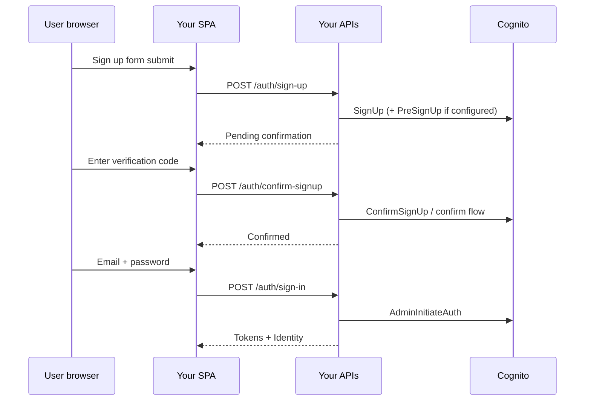
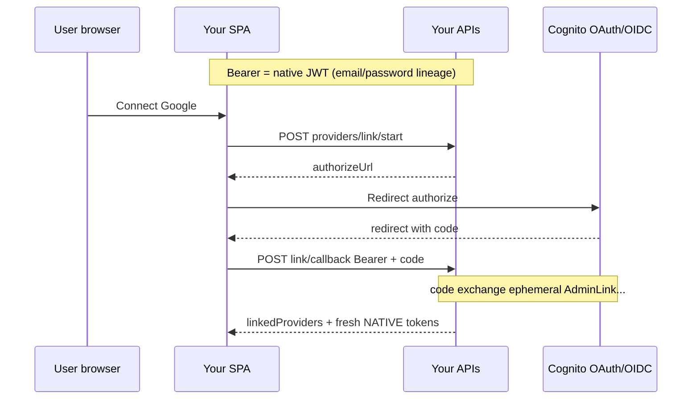
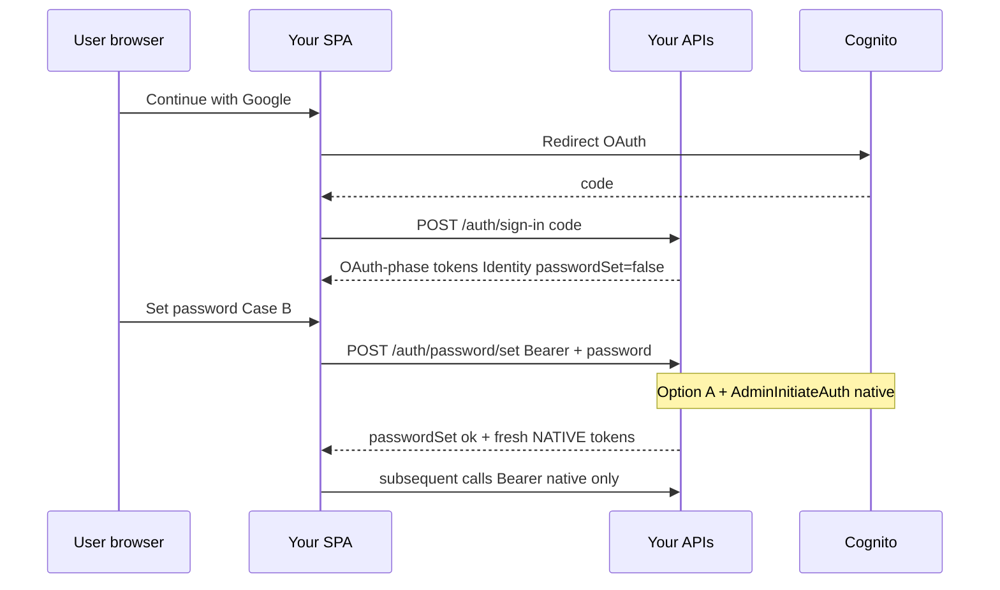
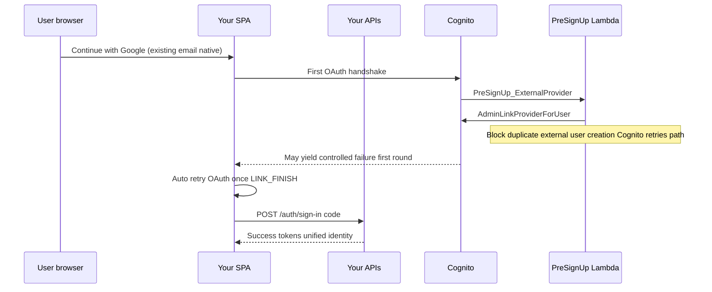

# Cross-method authentication — end-to-end flows & phased rollout

**Status:** execution plan  
**Goal:** One `Identity` per human, coherent Cognito wiring, deterministic APIs, frontend-friendly states (minimal scary errors).

**Companion docs:** [`account-linking-upgrade.md`](account-linking-upgrade.md) (audit + Option A detail), [`identity-upgrade.md`](identity-upgrade.md) (Identity as source of truth).

**Audience:** Backend + Frontend — scenarios first, implementation phases follow **in dependency order**.

---

## Decisions (locked for this rollout)

These came from backend/FE design discussion; implementations should converge here.

### Pattern — logged-in linking (Scenario 2)

- **Chosen approach:** explicit **Pattern 1** — user already has native tokens (`Authorization: Bearer`). They open Cognito/Google OAuth strictly to obtain a **`code`**; **`POST …/providers/link/callback`** (exact path TBD alongside [`routes`](../modules/cosmediate-authentication/lib/routes.mjs)) exchanges **`code`** server-side, validates email vs `Identity`, runs **`AdminLinkProviderForUser`** with **native (JWT / `Identity.cognitoSub`) as destination**. **Do not** rely on DB-only `linkedProviders` updates without Cognito success.
- **OAuth `state`:** **Not required for v1.** Accept increased CSRF risk on the authorize redirect until a later hardening (`state` JWT or server-stored nonce). Document in FE playbook.

### Token policy — after any merge (both directions)

- **Invariant:** Once **`AdminLinkProviderForUser`** (Pattern 1) **or Option A-native pivot** (Case B, Scenario 3) completes, **the SPA must hold only tokens whose JWT `sub` equals the consolidated native `Identity.cognitoSub`**. Ephemeral tokens from the Google handoff (`code` exchange) are **server-only fuel** (userInfo / provider subject / link API input); **never** treat them as the long-lived app session after success.
- **API contract:** successful **`link/callback`** and successful **`POST /auth/password/set`** (Option A) **return a fresh native token bundle** (access + id + refresh as your API already returns on sign-in). Client **discards** pre-merge tokens. Issuance options for link-callback when user did not re-type password: e.g. **`AdminInitiateAuth` + `REFRESH_TOKEN_AUTH`** if the client sends the **native** refresh token in the callback request body, or a **second OAuth `code` round-trip** after merge that mints tokens for the merged user — pick one implementation; product rule stays **native `sub` only**.

### Case B vs “already native + password”

- **Case B (Google-first, `passwordSet=false`):** requires **Option A** (`AdminCreateUser` + `AdminSetUserPassword` + `AdminLinkProviderForUser` + `Identity` rewrite). Endpoint canonical: **`POST /auth/password/set`** (replace drift from `set-new`).
- **Not Case B:** user already created via email/password and **already has a password** — adding Google is Pattern 1 only; later password changes are **`ChangePassword` / `POST /auth/password/update`**, not Option A.

### Scenario 4 (not logged in, same email, first Google)

- Still **PreSignUp** + block-after-link + **silent retry** (Phase 1). Separate from Pattern 1; does not replace explicit link for logged-in users.

---

## 0. Canonical user-visible scenarios (click → done)

Assume: your SPA owns all screens; each step calls **your** API Gateway + Lambdas. OAuth still redirects through Cognito’s **OAuth** URLs (authorize / token); that is separate from Hosted UI skins.

Legend:

- **Cognito OAuth redirect** — browser briefly leaves your app to IdP/Cognito authorize URL then returns with `code` or error.
- **Tokens** — your backend may exchange `code` **internally**; **after merges**, responses return **`{ access_token, id_token, refresh_token, … }` for the native consolidated user** (`sub` === `Identity.cognitoSub`). See **Decisions** above.

---

### Scenario 1 — Email/password only (baseline)

Happy path until the account is usable.

```
User clicks "Sign up" (email / password / name...)
    → Frontend: POST /auth/sign-up
    ← Backend: user created in Cognito (UNCONFIRMED) + Identity + Patient profile (per current authSignUp logic)

User opens email, enters code OR API confirms
    → Frontend: POST /auth/confirm-signup
    ← Backend: CONFIRMED in Cognito + Identity.status active (or aligned)

User signs in with email + password
    → Frontend: POST /auth/sign-in { email, password }
    ← Backend: AdminInitiateAuth (USER_POOL) + session stored + Identity in response

(Optionally forgot password anytime after confirm)
    → POST /auth/password/forgot … → /auth/password/reset
```



---

### Scenario 2 — Email/password account, then link Google/Facebook/etc.

**Chosen product pattern:** **Pattern 1 — explicit linking** — user already has **native** JWT (`Authorization: Bearer`). OAuth redirect exists only so Cognito/Google issue a **`code`**; **`code`→token exchange runs in Lambda**, yields short-lived OAuth tokens **used only inside the handler** to read userInfo / provider subject → **`AdminLinkProviderForUser`**. SPA **drops** those OAuth tokens.

High-level:

```
User completes Scenario 1 and has valid NATIVE access (and preferably refresh) token.

User taps "Connect Google"
    → Frontend: POST /auth/providers/link/start
      ← Backend: returns Cognito authorize URL only (OAuth `state` deferred for v1 — see Decisions)

    → Browser: redirect to authorize (?identity_provider=Google & client_id & redirect_uri & response_type=code & scope…)

User completes IdP consent; redirect to SPA with ?code=…

    → Frontend: POST /auth/providers/link/callback
         Headers: Authorization: Bearer <same native access token>
         Body: { code, redirectUri }  [+ native refresh_token in body if backend will mint via REFRESH_TOKEN_AUTH]

      ← Backend: validate JWT → Identity; exchange code (server-only); email match policy
         AdminLinkProviderForUser (destination = native Identity / cognitoSub)
         Read native user's identities; persist linkedProviders projection
         Mint fresh NATIVE session: Sub must match post-merge Identity.cognitoSub (see Token policy)
      ← Frontend: Store returned access/id/refresh; discard prior tokens if sub changed

Important: Same email, first-time Google, **not** logged in → Scenario 4 (PreSignUp), not this route.
```



---

### Scenario 3 — Social signup first, later set password (**Case B** — Option A)

This is **`passwordSet=false`**, JWT `sub` still on **federated lineage** until migration completes — **not** “native already exists + ChangePassword”.

Canonical backend steps ([`account-linking-upgrade.md`](account-linking-upgrade.md) §4.4 **Option A**):

1. **Bearer** OAuth session proves who is migrating.
2. **`AdminCreateUser`** native (`Username`=email convention; `SUPPRESS`; idempotent **`UsernameExistsException`**).
3. **`AdminSetUserPassword`** on that native username, `Permanent: true`.
4. **`AdminLinkProviderForUser`** — destination native `sub`, source Google (provider subject).
5. **`Identity`:** `cognitoSub` ← native `sub`, `passwordSet=true`, `linkedProviders` from Cognito **`identities`** on **native** user.
6. Optional **`AdminUserGlobalSignOut`** on old federated session for cleanliness.

**Token policy:** **`POST /auth/password/set` response includes a fresh native token bundle** — typically **`AdminInitiateAuth` + `ADMIN_USER_PASSWORD_AUTH`** with the **just-set password** (no extra round-trip). Client **replaces** all prior OAuth-only tokens.

User-visible flow:

```
User clicks "Continue with Google"
    → POST /auth/sign-in { code, redirectUri }  [first touch only — creates/finds Identity OAuth phase]

User opens Security → Set password
    → POST /auth/password/set  Body: { password }  Header: Bearer (OAuth session)
    ← Identity updated + **native** access/id/refresh returned (sub === native)

Later sign-ins: email+password or Google both resolve same native sub
    → POST /auth/sign-in { email, password } OR code flow — ListUsers resolves Username by Identity.cognitoSub match (never Users[0])
```



---

### Scenario 4 — Native email/password already exists → user clicks "Continue with Google" (same email)

This is **`PreSignUp_ExternalProvider` + linking** turf.

Desired outcome: **single pool identity** tied to **`Identity`** (no orphan `google_*`). Cognito/AWS pattern requires **preventing duplicate external user completion** after `AdminLinkProviderForUser`, then **one automatic retry sign-in**.

User-visible (smooth, not abusive):

```
User clicks Continue with Google
    → SPA → Cognito authorize → callback with code OR error payload from token exchange edge

FIRST attempt backend path when PreSignUp just linked provider:
Option A UX: Frontend receives structured response e.g. { code: ACCOUNT_LINK_FINISH, retryOAuth: true }
    → Frontend immediately kicks off same OAuth redirect AGAIN (no error toast), max 2 attempts.

SECOND attempt: Standard success — tokens minted for unified native sub
```

Behind the curtain (Phase 1): PreSignUp after successful link **`throw`/fail** signup completion so Cognito does not keep second user → first token exchange might fail mapped to **silent retry**.



---

## 1. Success criteria (Invariant checklist)

Before closing the project:

| Invariant | Check |
|-----------|-------|
| At most **one authoritative `sub`** on `Identity` for a session after linking/OAuth pwd | Tokens’ `sub` === `Identity.cognitoSub` === authorizer lookup |
| **No orphan** external-only pool user lingering for same email as native linked path | Verified in Cognito console / list users |
| **Email sign-in** always resolves **`Username`** by **`sub` match**, not **`Users[0]`** | Code + tests |
| **`linkedProviders`** is projection of Cognito `identities`, not guesses | Parsed from Cognito payloads |
| **`POST /auth/password/set` (Case B / Option A) returns native token bundle**; SPA drops OAuth-only tokens | Scenario 3 E2E |
| **`link/callback` (Pattern 1) returns native token bundle**; OAuth handoff tokens never retained as session | Scenario 2 E2E |
| Frontend never shows raw Cognito — only **typed error codes / retry hints** | Contract doc/table |

---

## 2. Phased implementation (single ordered track)

**Dependency order:** Phases are numbered roughly by risk prerequisites (Scenario 4 PreSignUp unblocks orphaned users; **`sub`**-matched **`ListUsers`** unblocks deterministic auth). When shipping, **prioritize what FE needs first** — see **§4 Next step** below.

---

### Phase 1 — Cognito PreSignUp: correct auto-link semantics — **DONE**

**Files touched:** [`modules/cosmediate-pre-auth-signup/index.mjs`](../modules/cosmediate-pre-auth-signup/index.mjs), [`lambdaLayer/nodejs/lib/auth/registry.mjs`](../lambdaLayer/nodejs/lib/auth/registry.mjs).

**What was done:**

1. **Post-link blocking restored:** After a successful **`AdminLinkProviderForUser`** (existing **CONFIRMED** native Cognito user + federated signup for a **new** IdP provider on that email), the Lambda **`throw`**s **`ProviderLinkedRetryException`** so Cognito does **not** finalize a duplicate federated-only pool user. The link remains in Cognito; the client should **retry the same OAuth authorize flow once** (see rollout doc Scenario 4 / FE contract Phase 7).
2. **Provider naming normalized in the shared layer:**
   - **`parseCognitoExternalUsername`** — parses `userName` on **first `_` only** (supports `SignInWithApple_<sub>` paths that `split("_")` mishandled).
   - Maps prefixes to Cognito **`AdminLinkProviderForUser`** names (`Google`, `Facebook`, **`SignInWithApple`**, `LoginWithAmazon`, …).
   - **`cognitoProviderSortKey`** — stable comparisons against **`identities[].providerName`**.

**Deploy note:** Lambda must run on the **updated layer** artifact that exports these helpers (`/opt/nodejs/lib/auth/registry.mjs`).

---

### Phase 2 — Resolve Cognito `Username` from `Identity.cognitoSub` — **DONE**

**Files touched:** [`lambdaLayer/nodejs/services/auth.mjs`](../lambdaLayer/nodejs/services/auth.mjs), [`lambdaLayer/nodejs/lib/auth/registry.mjs`](../lambdaLayer/nodejs/lib/auth/registry.mjs), [`modules/cosmediate-authentication/controllers/auth.mjs`](../modules/cosmediate-authentication/controllers/auth.mjs), [`modules/cosmediate-authentication/controllers/password.mjs`](../modules/cosmediate-authentication/controllers/password.mjs).

**What was done:**

1. **`resolveCognitoUsernameByEmailAndSub`** in the Lambda layer paginates **`ListUsers`** (`Filter: email = "…"` with embedded-value escaping until **`PaginationToken`** is exhausted), then selects the unique row whose **`Attributes.sub`** equals **`Identity.cognitoSub`**. No **`Users[0]`** guessing.
2. **Strict outcomes:** **`ok: true`** with **`username`** · **`reason: 'ambiguous'`** (multiple `sub` matches) → **`409`** + **`COGNITO_IDENTITY_MISMATCH`** · **`reason: 'none'`** → **`422`** + same exception code (`CognitoIdentityMismatchException`).
3. **Call sites:** **`authSignIn`** email+password branch; **`setNewPassword`**; **`forgotPassword`** + **`resetPassword`** (Forgot flows now pass **`calculateSecretHash( resolvedUsername , …)`** aligned with **`Username`**).
4. **`updatePassword`** (post-**`ChangePassword`**) resolves username **best-effort** for optional future **`AdminGlobalSignOut`** logging only — no hard fail after password change succeeds.

**Deploy note:** Ship authentication Lambdas together with updated **`lambdaLayer`** export **`resolveCognitoUsernameByEmailAndSub`**.

---

### Phase 3 — OAuth sign-in branch: identities + projections — **DONE**

**Files touched:** [`lambdaLayer/nodejs/lib/auth/registry.mjs`](../lambdaLayer/nodejs/lib/auth/registry.mjs), [`lambdaLayer/nodejs/services/auth.mjs`](../lambdaLayer/nodejs/services/auth.mjs), [`modules/cosmediate-authentication/controllers/auth.mjs`](../modules/cosmediate-authentication/controllers/auth.mjs) (OAuth + **`linkOAuthProvider`** slug handling).

**What was done:**

1. **`cognitoProviderDisplayNameToLinkedSlug`** + **`linkedProviderSlugsFromCognitoIdentities`** — canonical DB **`linkedProviders`** slugs from Cognito **`identities[].providerName`** (removes bogus **`google`** default when **`username`** is merged native/email).
2. **`getLinkedProviderSlugsForPoolUsername`** — **`AdminGetUser(Username=userinfo.username)`** + parse **`identities`** JSON attribute; fallback to **`parseCognitoExternalUsername`** when attribute absent.
3. **`authSignIn` OAuth (`code`):** requires non-empty slug list (**`422`** **`OAUTH_PROVIDER_UNRESOLVED`**). If **`Identity`** exists **`cognitoSub` ≠ token `sub` → **`403`** **`COGNITO_IDENTITY_MISMATCH`**. **`linkedProviders`** rewritten to Cognito-derived list when it differs (**500** if Postgres update fails).
4. OAuth-only **`createUserInDB`** uses full **`oauthLinkedSlugs`**.
5. **`linkOAuthProvider`:** shared slug resolver; **`OAUTH_ALREADY_LINKED`** when **`oauthLinkedSlugs`** ⊆ existing DB (**every** slug **`∈`** current array); otherwise union-merge projection (**real Cognito **`AdminLink`** stays Phase 5**).

**Deploy note:** **`AUTH_EXCEPTIONS.OAUTH_PROVIDER_UNRESOLVED`** + layer export **`getLinkedProviderSlugsForPoolUsername`**.

---

### Phase 4 — OAuth → Password (**Case B**, Option A) as `/auth/password/set` — **DONE**

**Files touched:** [`lambdaLayer/nodejs/services/auth.mjs`](../lambdaLayer/nodejs/services/auth.mjs) (`identitiesFromAdminUser`, `resolveFederatedLinkSource`, `cognitoTryLinkProviderToNative`), [`lambdaLayer/nodejs/lib/auth/registry.mjs`](../lambdaLayer/nodejs/lib/auth/registry.mjs) (`AUTH_EXCEPTIONS.PASSWORD_ALREADY_SET`, `ROUTE_PERMS`), [`lambdaLayer/nodejs/lib/api/registry.mjs`](../lambdaLayer/nodejs/lib/api/registry.mjs) (`CRUD_ACTIONS.AUTH.SET_PASSWORD`), [`lambdaLayer/nodejs/lib/validation/registry.mjs`](../lambdaLayer/nodejs/lib/validation/registry.mjs), [`password.mjs`](../modules/cosmediate-authentication/controllers/password.mjs) (`setPassword`), [`routes.mjs`](../modules/cosmediate-authentication/lib/routes.mjs), [`utils.mjs`](../modules/cosmediate-authentication/lib/utils.mjs) (`updateIdentityOauthNativePasswordPivot`).

**What was done:**

1. **`POST /auth/password/set`** (`**setPassword`**): Bearer + `{ userId, email, password }` (reuse **`AuthSetNewPassword`** schema). **409** **`PASSWORD_ALREADY_SET`** if **`Identity.passwordSet`**. Owner session **`authContext.sub`** must match **`Identity.cognitoSub`** (**`403`** **`COGNITO_IDENTITY_MISMATCH`**). Admins with **`PASSWORD_SET`** cannot execute federated Option A (**422** — owner must finish while OAuth-signed-in); admins can assist only when **`resolveCognitoUsernameByEmailAndSub`** succeeds (native shortcut + tokens).
2. **Idempotent Option A** when resolution fails (**`reason: none`**): **`AdminCreateUser`** (`**SUPPRESS**`, ignore **`UsernameExistsException`**), **`cognitoTryLinkProviderToNative`** (duplicate-link noop), **`AdminSetUserPassword`**, Postgres pivot **`updateIdentityOauthNativePasswordPivot`** (`**cognitoSub**`, **`passwordSet`**, **`linkedProviders`** from **`getLinkedProviderSlugsForPoolUsername`**).
3. **Shortcut** when **`resolveCognitoUsernameByEmailAndSub`** **ok**: **`AdminSetUserPassword`** + same DB/session pipeline.
4. **201** response: **`sendResponse`-style** **`accessToken`** / **`sessionId`** / **`user`** (refetched **`Identity`**), **`storeSession`**, tokens from **`ADMIN_USER_PASSWORD_AUTH`** (`**mintNativeTokensAfterPasswordSet**`, **`NEW_PASSWORD_REQUIRED`** handled like **`authSignIn`**).

**`/auth/password/set-new`** remains unchanged (set password **without** token bundle). **`set`** is canonical Case B per § Decisions.

**Deploy:** API authorizer includes **`POST:/auth/password/set`** (same **`ROUTE_PERMS`** keys as **`set-new`**).

**Exit:** Scenario 3 — one call completes native pivot + SPA holds native JWTs.

---

### Phase 5 — Explicit social link (**Pattern 1**) for logged-in native users — **DONE**

**Files touched:** [`lambdaLayer/nodejs/lib/auth/registry.mjs`](../lambdaLayer/nodejs/lib/auth/registry.mjs) (`AUTH_EXCEPTIONS.PROVIDER_ALREADY_LINKED`, `ROUTE_PERMS`), [`lambdaLayer/nodejs/lib/api/registry.mjs`](../lambdaLayer/nodejs/lib/api/registry.mjs) (`LINK_OAUTH_START`, `LINK_OAUTH_CALLBACK`), [`validation/registry.mjs`](../lambdaLayer/nodejs/lib/validation/registry.mjs), [`schemas/auth.mjs`](../lambdaLayer/nodejs/lib/validation/schemas/auth.mjs) (`AuthOAuthLinkStart`, optional `refreshToken` on link body), [`auth.mjs`](../modules/cosmediate-authentication/controllers/auth.mjs), [`routes.mjs`](../modules/cosmediate-authentication/lib/routes.mjs).

**What was done:**

1. **`POST /auth/oauth/link/start`** (**`oauthLinkStart`**): native **`Bearer`**; body **`redirectUri`**, optional **`identityProvider`** (Hosted UI param); **`200`** **`authorizeUrl`**. v1 deliberately omits **`state`** on Hosted UI (**CSRF** mitigated via SPA-held session plus single-use **`code`** **`+`** native **`Bearer`** on **`callback`**).
2. **`POST /auth/oauth/link/callback`** (**`linkOAuthCallback`**): **`code`** and **`redirectUri`**; **`oAuthLogin`** then **`AdminGetUser`** **`+`** **`resolveFederatedLinkSource`** **`+`** **`cognitoTryLinkProviderToNative`**. Duplicate link → **409 **`PROVIDER_ALREADY_LINKED`**. Postgres **`linkedProviders`** only after Cognito success (**`getLinkedProviderSlugsForPoolUsername`** on resolved native **`Username`**).
3. Native token bundle (**`refresh-assisted`**)**:** optional body **`refreshToken`** **`→`** **`refreshViaOauth`** **`+`** **`storeSession`** **`+`** **`sendResponse`** fields; **`tokensIssued`** indicates whether refresh ran.

**Structured errors **`EMAIL_MISMATCH`**, **`PROVIDER_ALREADY_LINKED`**, **`OAUTH_PROVIDER_UNRESOLVED`**, **`COGNITO_IDENTITY_MISMATCH`**.

**Exit:** Scenario 2 **`link/start`** **`→`** Hosted UI **`→`** **`link/callback`** with native session ( **`refreshToken`** **`optional`** for fresh JWT envelope).

---

### Phase 6 — Pre-token-gen + Authorizer coherence — **DONE**

**Files touched:** [`modules/cosmediate-pre-auth-token-gen/index.mjs`](../modules/cosmediate-pre-auth-token-gen/index.mjs), [`modules/cosmediate-api-authorizer/index.mjs`](../modules/cosmediate-api-authorizer/index.mjs).

**What was done:**

1. **`cosmediate-pre-auth-token-gen`:** Stops emitting **`DEFAULT_ROLE`** with empty **`identityId`** after a swallowed Postgres failure ([account-linking-upgrade §3.7](account-linking-upgrade.md)). Reads **retry **`PRETOKEN_DB_RETRIES`** (**default **`3`****)** **`with`** **`PRETOKEN_DB_TIMEOUT_MS`** (**`2800`** **ms`** default)** **`Promise.race`**. Exhaustion **`throws`** ⇒ Cognito does **not** finalize tokens (**fail-closed**). **`PRETOKEN_FAIL_OPEN_ON_DB_ERROR=true`** restores prior behaviour for outages. **`withTimeout`** **≈** **`4700`** **ms**.
2. **`cosmediate-api-authorizer`:** After **`getIdentityByCognitoSub`**, optional **`getIdentityByEmail`** using JWT **`email`** or **`username`** containing **`@`**, accepted **only **`if`** **`identity.cognitoSub === token.sub`**. **`cognitoSub`** **mismatch for that email ⇒ deny (**stale** **token** **`after`** **`pivot/link`****) **`with`** explicit context. **`AUTHORIZER_IDENTITY_RETRIES`** **(**default **`3`****)** retries **only **`on`** Prisma **`throw`** (**transient infra** **`).

---

### Phase 7 — Frontend contract (`GET /auth/me/methods` + error code table) — **DONE**

**Files touched:** [`lambdaLayer/nodejs/lib/auth/registry.mjs`](../lambdaLayer/nodejs/lib/auth/registry.mjs) (`ROUTE_PERMS`, bounded-retry constants, `PERMISSION_GROUPS` as used by SPA), [`me.mjs`](../modules/cosmediate-authentication/controllers/me.mjs), [`routes.mjs`](../modules/cosmediate-authentication/lib/routes.mjs), [`controllers/registry.mjs`](../modules/cosmediate-authentication/controllers/registry.mjs) (`getRegistry` `auth` payload).

**Endpoint:** `GET:/auth/me/methods` — authorizer needs `profile:get` and `profile-section`. Response includes:

- `identityId`, `email`
- `passwordSet`, `linkedProviders` (canonical slugs, deduped, sorted)
- `canRemovePassword` (true when password is set and at least one linked provider exists)
- `canUnlink` — object keyed by each linked slug; true when unlinking that slug still leaves password or another linked provider
- `hasMinimumOneSignInMethod`
- `oauthLinkPermitted` (token `perms` grants `auth-oauth-provider:link`)
- `boundedRetryFlows` — duplicate of `AUTH_BOUNDED_RETRY_FLOWS` from the Lambda layer

`GET /auth/registry` also exposes `AUTH_BOUNDED_RETRY_FLOWS` and `PROVIDER_LINKED_RETRY_EXCEPTION_CODE` under `registry.auth`.

#### Retry vs fatal (Scenario 4 and related)

| Situation | Treatment |
|-----------|-----------|
| PreSignUp linking path throws `ProviderLinkedRetryException` (Hosted UI / Cognito shows Lambda error code or name) | **Bounded retry:** at most **2** fresh Hosted UI `/oauth2/authorize` round-trips; see `AUTH_BOUNDED_RETRY_FLOWS[0]`. |
| `POST /auth/sign-in` returns **400** and message includes `Failed to fetch token` (flake / network during code exchange) | **Bounded retry:** at most **2** with a new code; see `AUTH_BOUNDED_RETRY_FLOWS[1]`. |
| `EMAIL_MISMATCH`, `PROVIDER_ALREADY_LINKED`, `PASSWORD_ALREADY_SET`, `403` identity/sub mismatch, `422` `OAUTH_PROVIDER_UNRESOLVED`, most `409` conflicts | **Fatal** for blind loops — show UI; do not spin Hosted UI indefinitely. Use response `code` / message. |

**Exit:** SPA can read `boundedRetryFlows` (or registry) and drive Settings from `canRemovePassword` / `canUnlink`.

---

### Phase 8 — Regression harness

Execute full matrix from **[§8 checklist in account-linking-upgrade](account-linking-upgrade.md#8-testing-checklist)** plus Scenario 3 Option A concurrency (two tabs).

---

## 3. What not to do

- Fixing only `authSignIn` without Phase 1 recreates orphaned pool users downstream.
- Storing **`linkedProviders`** without Cognito succeeding — lies to future authz.
- Using **`Identity.cognitoSub` as Cognito Username** fallback for **`AdminSetUserPassword`** — invalid for most federated aliases.
- Returning **OAuth handoff-only** tokens (pre-merge **`sub`**) after successful **`link/callback`** or **`/auth/password/set`** instead of issuing **native** tokens per **§ Decisions**.

---

## 4. Next step

Suggested order:

1. **Phase 5 (Pattern 1)** + **Phase 4 (Case B / Option A)** in tight iteration with FE — establishes **explicit link** + **native token issuance** contracts.
2. **Phase 1 (PreSignUp)** for Scenario 4 (logged-out Google, email already native).
3. **Phase 2** ListUsers **`sub`** match fixes for **all** `ADMIN_USER_PASSWORD_AUTH` callers.

Teams may parallelize Phase 2 with Phase 4/5 if capacity allows — **never** merge large DB-only `linkedProviders` changes without **`AdminLinkProviderForUser`** success.
