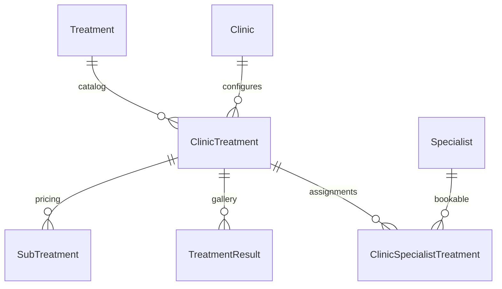

# Clinic & specialist domain rules

Contract for backend implementation of clinic org structure, specialist placement, treatment offerings, and patient roster links. Postgres link tables are **source of truth**; OpenSearch carries denormalized read projections only.

See also: [domain-relations-roadmap.md](./domain-relations-roadmap.md) for sprint history and org helpers.

---

## Glossary

| Term | Meaning |
|------|---------|
| **parentClinicId** | Specialist home clinic (single `FULL_TIME` link with `isPrimary: true`). Use this name everywhere — not `primaryClinicId`. |
| **Roster** | Patients returned by list APIs from `PatientClinic` / `PatientSpecialist` junctions — not a separate table. |
| **ClinicTreatment** | Clinic offering hub — one row per `(clinicId, treatmentId)`. Sub-treatments, results, and assignments hang from it. |
| **ClinicSpecialistTreatment** | Specialist assignment to a `ClinicTreatment` (bookable link). Includes `specialistExperience`. |
| **ACTIVE assignment** | `ClinicSpecialistTreatment.status = ACTIVE`. |
| **ACTIVE offering** | `ClinicTreatment.status = ACTIVE`. |

---

## Clinic org tree

- One **PARENT** org root per clinic brand; **NODE** branches via `Clinic.parentClinicId`.
- Managers link via `ClinicManagerLink` (same org only). Link to PARENT ⇒ org-wide effective scope; branch-only links ⇒ exact clinic ids (`resolveManagerEffectiveClinicIds`).
- New PARENT clinic: bootstrap a **new** manager or attach **brand-new** managers only.
- New NODE branch: may attach **existing** managers from the same org.

---

## Specialist placement

### Association types

`SPECIALIST_CLINIC_ASSOCIATION`: `FULL_TIME` | `FREELANCE` only (`VISITING` removed).

| Type | Home clinic | Who creates | Clinic assignment updates |
|------|-------------|-------------|---------------------------|
| **Full-time** | Exactly one (`parentClinicId`) | Admin or manager (manager ⇒ caller's active clinic) | Admin: set one clinic anywhere. Manager: **transfer** within same org only. |
| **Freelance** | N/A (multi-clinic) | Admin only | Admin: add/remove any clinics. Clinics: **view only** — no profile edits, no treatment management. |

**Forbidden after create:** changing `workingType` between full-time and freelance.

**List/search scope:** branch-scoped by manager's **`activeClinicId`** (OpenSearch filter on `parentClinicId` / `clinicIds`). Manager auth may be org-wide; **data lists** follow active clinic.

---

## Clinic assignment cascade (Phase 6)

Do **not** delete `ClinicSpecialistTreatment` rows when links change. Use `status` (`ACTIVE` | `INACTIVE`).

### Leaving a clinic (`fromClinicId`)

1. `ClinicSpecialistLink` → `INACTIVE`.
2. All `ClinicSpecialistTreatment` for `(specialistId, fromClinicId)` → `INACTIVE`.
3. **`ClinicTreatment`**, **`SubTreatment`**, **`TreatmentResult`** stay at that clinic — never moved or deleted.
4. Specialist profile offerings at old clinic drop off (no ACTIVE assignments).

### Joining / transfer to new clinic

1. `ClinicSpecialistLink` → `ACTIVE` (or create).
2. **No auto-copy** of assignments or offerings — new clinic manager assigns fresh from their `ClinicTreatment` pool.

### Re-attach same clinic

- Link → `ACTIVE`; matching INACTIVE `ClinicSpecialistTreatment` rows → `ACTIVE` again.

Helper: `clinic-specialist-treatment-cascade.mjs` in specialists module (Phase 6.1).

---

## Treatment hub model (Phase 6)

### Who manages what

| Actor | ClinicTreatment | SubTreatments | Assignments | Results |
|-------|-----------------|---------------|-------------|---------|
| **Clinic / manager** | Select at `activeClinicId` | Under each ClinicTreatment | FT + freelance at clinic | Under each ClinicTreatment |
| **Admin** | Any clinic | Same | Same | Same + ADMIN catalog |
| **Specialist** | Read only | Read only | Read only | Read only |

### Removal guard

Cannot set `ClinicTreatment` to INACTIVE while ACTIVE `ClinicSpecialistTreatment` rows exist — return **409** (`clinic_treatment_has_assignments`).

### Denormalized fields

Set on write; refreshed when master `Treatment` or `TreatmentCategory` changes:

- `ClinicTreatment`: `categoryId`, `categoryName`, `treatmentName`, `treatmentImage`, `treatmentOverview`
- `ClinicSpecialistTreatment`: above + `clinicId`, `treatmentId`, `specialistExperience`
- `SubTreatment` / `TreatmentResult`: `clinicId`, `treatmentId`, `categoryId`, `categoryName`

### Booking (future)

- Reference **`clinicTreatmentId` only**
- Optional specialist: filter specialists with ACTIVE assignment for that offering after treatment is selected

---

## Patient model

### One email, one patient

- `Identity.email` is globally unique — never duplicate `Patient` rows.
- Relationships via `PatientClinic` / `PatientSpecialist` with `PatientRelationSource`.

### Profile provision: `Patient.creationSource`

| Path | `creationSource` |
|------|------------------|
| Admin create | `ADMIN` |
| Self signup / OAuth | `SELF_SIGNUP` |
| Manager create | `MANAGER` |
| Specialist create | `SPECIALIST` |

### Junction sources (`PatientRelationSource`)

`CLINIC_CREATE` | `SPECIALIST_FULLTIME_CREATE` | `SPECIALIST_FREELANCE_CREATE` | `APPOINTMENT`

| Creator | Junctions on create |
|---------|---------------------|
| Admin | None |
| Self signup | None |
| Manager | `PatientClinic` → `CLINIC_CREATE` (requires scoped `clinicId`) |
| Full-time specialist | `PatientSpecialist` + `PatientClinic` at `parentClinicId` |
| Freelance specialist | `PatientSpecialist` only |

Helper: `applyPatientCreateJunctionWritesInTx` in `patient-create-junction.mjs`.

### Duplicate email on staff create

- Return **409 CONFLICT** — no new Identity, no junction writes.
- Message for manager/specialist: booking hint for existing patients.
- **No `POST /patients/link`.**

### Clinic manager patient tab (org-shared roster)

List patients linked to **any clinic in the org** (`resolveClinicOrgIds`). Specialist tab remains specialist-scoped.

---

## OpenSearch denormalization

Postgres links → denormalized arrays at index time; re-index on link/profile changes.

| Index | Fields |
|-------|--------|
| `clinics` | `managerIds[]`, `specialistIds[]` |
| `clinic_managers` | `clinicIds[]` |
| `specialists` | `clinicIds[]`, `parentClinicId`, `treatmentCount` (no profile-level prices) |
| `patients` | `patientClinicIds[]`, `patientSpecialistIds[]`, `patientOrgRootIds[]` |
| `clinic_treatments` | `clinicId`, `treatmentId`, `categoryId`, `categoryName`, prices |
| `clinic_specialist_treatments` | FK + denorm fields, `brandIds[]`, `specialistExperience` |
| `treatment_results` | `clinicTreatmentId`, `specialistIds[]`, category denorm |

---

## Code conventions

- Thin controllers, `*.service.mjs`, `*-compliance.service.mjs`, `*-search.service.mjs`.
- JSDoc on non-trivial exports (`@param`, `@returns`, behavior notes).
- Compliance via DDB activity/audit pattern.

---

## Phase ownership

| Phase | Scope |
|-------|-------|
| **6.0** (this migration) | `ClinicTreatment` hub schema, rename `SpecialistTreatment` → `ClinicSpecialistTreatment`, sub-trt/results FK migration |
| **6.1** | Assignment cascade on clinic link changes |
| **6.2–6.5** | ClinicTreatment / sub-trt / assignment / result services + APIs |
| **6.6** | OS aggregates + denorm cascade on master entity updates |
| **6.7–6.11** | Public DTOs, clinic/specialist/public FE, legacy cleanup |
